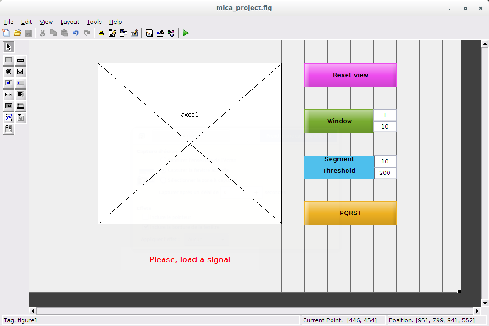
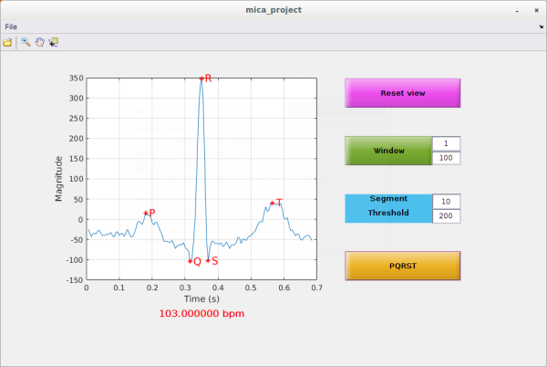

# MICA project : Matlab Implementation of a Cardiologist Assistant

This project addresses the problem of automated diagnosis of cardiac pathologies, via the signals provided by electrocardiogram (ECG) measurement devices. Basic signal processing techniques are used to remove undesired components altering the ECG quality, and estimate various parameters providing important information about the cardiac activity and detect irregularities such as arrhythmia, tachycardia, brachycardia, etc. This repo provides the necessary sources and informations in order to create your own GUI assistant with MATLAB.

## Getting Started

These instructions will get you a copy of the project up and running on your local machine for development and testing purposes.

### Prerequisites

You need to download the ECG signals and a simple version the assistant. On a Linux or macOS distribution, open a terminal and clone the git repo with the following command : 

```
git clone https://gitlab.com/batalinux/MICA_project.git
```

On a Windows distribution, you need to download a git client (https://git-scm.com/downloads) first.

## Files

### Root folder

This section described the different files and folders in this repository.

#### main.m

This files computes a simple analysis of an ecg signal. You can use it to test the different processing methods. 
This first version will plot the temporal signal, compute its cardiac rythma and display the different P, Q, R, S, T points for a specific segment.  

#### run_gui.m

This script will launch the Matlab GUIDE tool to create a GUI interface for your assistant. You can learn how to use GUIDE on the folowing adress : 

* https://fr.mathworks.com/videos/creating-a-gui-with-guide-68979.html

When you run the script, you should obtain a a new window which looks like :



This is your GUIDE editor. You can run it by doing "tools -> run" or clicking the run button. 
It will open a new window wich is your assitant !



You can can now load a signal by clicking on the "open" item of toolbar : 

This first version is a GUI implementaion of the main.m script. You can plot the temporal evolution, narrow the time window and display the ECG characteristics by ajusting the threshold and the segment.

When you run the GUIDE edtor, it creates ".m" and ".fig" files located in the "src" folder. The ".m" file contains all the callback functions of the different buttons and textbox. You can open it by clicking on the editor button : 

To launch manually the GUIDE editor (to create a new interface for instance), you need to type the following command in the MATLAB prompt :

```
guide
```

### src folder

This folder contains the different functions used by the main script and the GUIDE interface.

#### bpm_threshold.m

This function computes the cardiac rythma in BPM by using the R-R distance obtained by the treshold method. 

#### ecg_threshold.m

This function cumputes and returns the location of the P, Q, R, S and T point for the specified segment number and threshold value.

#### mica_project.m

This script contains all the functions used by the GUIDE interface. You can find the associated function an interface item by "right click ->  View Callbacks -> Callback" in the GUIDE editor.

#### mica_project.fig

This file contains the interface created by GUIDE. 

### data folder

This folder contains the different ECG signals you can open and process with the main script and the GUIDE interface.

### images folder

This folder contains some pictures to illustrate the GUIDE interface.

## Authors
* **Nolwenn TAN** (nolwenn.tan@ihu-liryc.fr)
* **Baptiste LAPORTE-FAURET** (baptiste.laporte-fauret@ims-bordeaux.fr)
* **Romain TAJAN** (romain.tajan@ims-bordeaux.fr)

## License

This project is licensed under the MIT License - see the [LICENSE.md](LICENSE.md) file for details

## Acknowledgments

* ECG processing methods explained : https://www.youtube.com/watch?v=TJR2AfxVHsM

