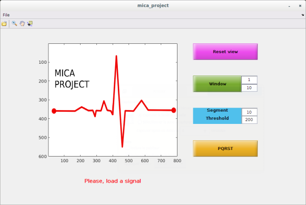

# MICA project : Matlab Implementation of a Cardiologist Assistant

This project addresses the problem of automated diagnosis of cardiac pathologies, via the signals provided by electrocardiogram (ECG) measurement devices. Basic signal processing techniques are used to remove undesired components altering the ECG quality, and estimate various parameters providing important information about the cardiac activity and detect irregularities such as arrhythmia, tachycardia, brachycardia, etc. This repo provides the necessary sources and informations in order to create your own GUI assistant with MATLAB.

## Getting Started

These instructions will get you a copy of the project up and running on your local machine for development and testing purposes.

### Prerequisites

You need to download the ECG signals and a simple version the assistant.

```
git clone ADRESSE DU GITCLONE
```

## Files

This section described the different files and folders in this repository.

### Main.m

### run_gui.m




## Authors
* **Nolwenn TAN** (nolwenn.tan@ihu-liryc.fr)
* **Baptiste LAPORTE-FAURET** (baptiste.laporte-fauret@ims-bordeaux.fr)
* **Romain TAJAN** (romain.tajan@ims-bordeaux.fr)

## License

This project is licensed under the MIT License - see the [LICENSE.md](LICENSE.md) file for details

## Acknowledgments

* ECG processing methods explained : https://www.youtube.com/watch?v=TJR2AfxVHsM

